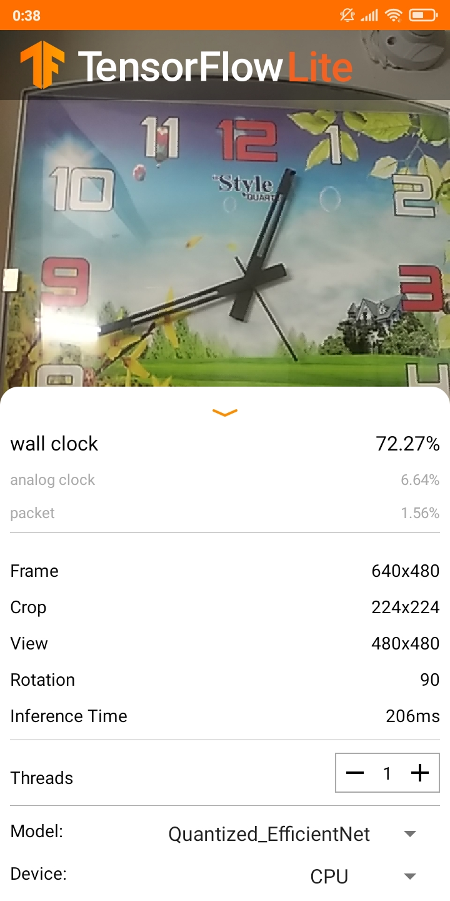

# Object-Classifciation

This app is made using Tensorflow lite & Java APIs. This is one of the basic project that I have made changes on while leraning some basic application using tensorflow lite.
 

This application has got a very high accuracy rate and can most of the time tell what you have been pointing at.
 
<ing src= "ML2.JPG" width="70" height="70">
